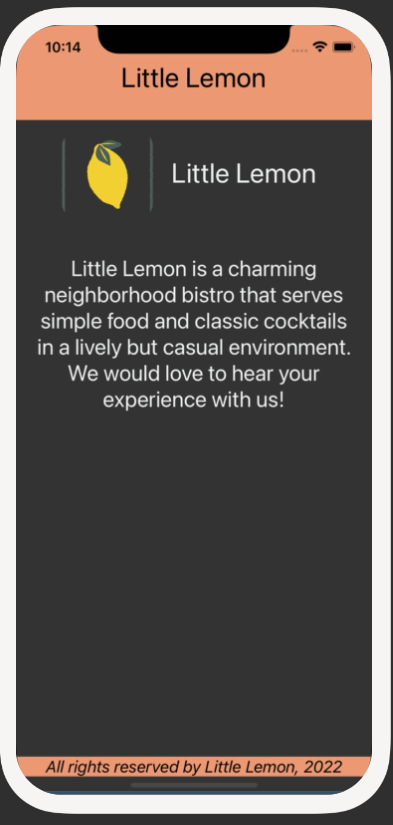

# Scenario
Your next duty is to add a unique Little Lemon logo to the Welcome screen. 

Below you’ll find the logo you will need to add, in the form of a PNG file. 

You will add the Image component to the Welcome Screen to render the Little Lemon logo. 

The image below is an example of how your app should look after you complete this exercise:

Colors that you will use:

`#EE9972`, `#EDEFEE`, `black` and `white`.

## Instructions
### Step 1: Import the Little Lemon logo 
Your first step is to import the Little Lemon logo image into your project. To make sure that you have it available, right-click on the Little Lemon logo image in Scenario and then click on Save image as... to save it to your local drive as a .png file. Create an image folder in your project and then add the logo.png file to it.

You can name it as follows with the following folder structure within the root folder of your project:

img/logo.png

### Step 2: Configure the image component within the Welcome Screen
Your next step is to configure the Image component within the welcome screen. It should display the Little Lemon logo that you just imported on the screen. Import the Image component within your Welcome screen to start using it.

### Step 3: Style the component
In this step, you will style the logo image and the welcome heading, to match the screenshots. Make sure to provide meaningful names for all your styles.

Hint: You can set the image’s height, width and borderRadius styles to match the screenshots.

## Conclusion
By completing this exercise, you will demonstrate your understanding and ability to configure and utilize the Image component to display images within your React Native app.