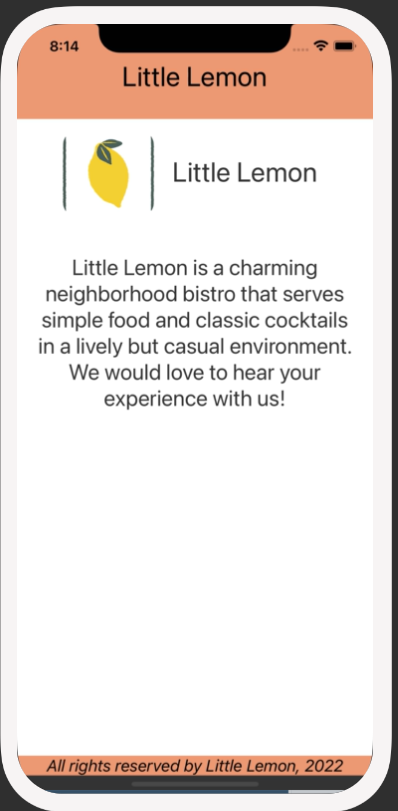
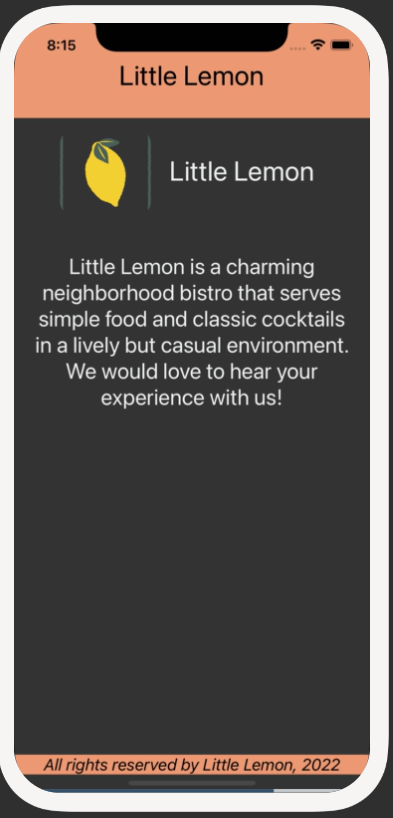

# Exercise: Hooks in React Native

## Overview
So far, you have learned about some of the hooks in React Native and how to use them. One of the hooks that was covered was useColorScheme, which allows you to detect the user’s preferred color scheme automatically.

In this exercise, you will use the useColorScheme hook to make the Little Lemon app automatically switch between dark mode and light mode, based on the theme setting of the device.

`Light mode Welcome Screen:`

`Dark mode Welcome Screen:`

## Instructions
### Step 1: Configure the useColorScheme hook within Welcome Screen
Your first step is to configure the useColorScheme hook within the Welcome screen. Make sure to import useColorScheme from React Native. Call the useColorScheme hook function and store its results in a variable within the Welcome screen (instatiate a hook).

### Step 2: Style Welcome Screen based on Light mode vs. Dark mode
Once you have the information on whether the user is on light mode or dark mode via the hook, you are ready to style the page. Add the specific the specific light or dark mode styles. Utilize the hook to establish conditional styling based on the theme that is currently set.

## Conclusion
By completing this exercise, you will demonstrate your understanding and ability to configure hooks in React Native.

