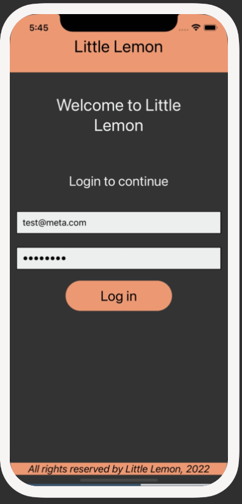
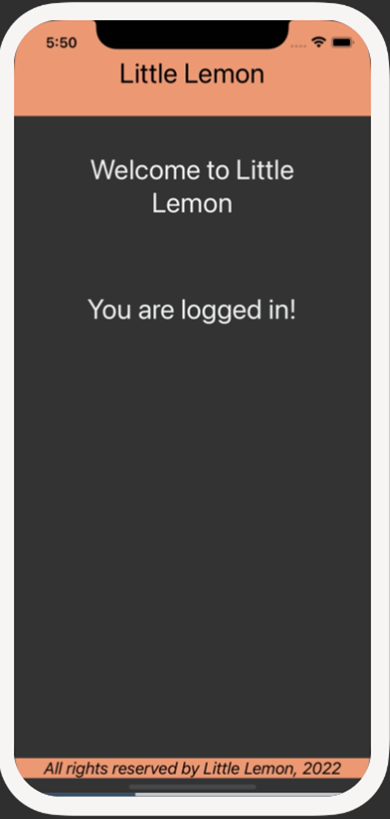

# Exercise: Create a clickable text area with Pressable

## Scenario
Recall the Login screen that you built in a previous exercise. It should consist of two text input boxes: one for entering an email address and another for entering a password.

This time, you have been asked to build a Login button for the Login screen. You will use the Pressable component to create a simple login button for the login screen.

When the user clicks on the Login button, the message that the user has logged in successfully will be displayed on the screen.

## Before Login

## After Login

Colors that you will use:
`#EE9972, #EDEFEE, black and white.`

## Instructions

### Step 1: Configure Pressable Component within Login Screen
Start off by configuring the Pressable component within the login screen. It should display the text Login, and it should be pressable. 

### Step 2: Track logged-in status using local state and update UI if logged in
After configuring the Pressable, you will store the status of whether the user is logged in or not as a local state. 

Hint: When the Pressable component is pressed, then toggle the user’s login state.

### Step 3: Style the component
Before you finish, style the Login button that you have created to match the screenshots above. Make sure to provide meaningful names for all your styles.

## Conclusion
By completing this exercise, you will demonstrate your understanding and ability to configure and utilize the Pressable component to create pressable areas within the app.
