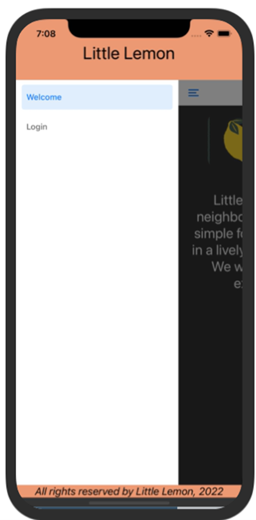
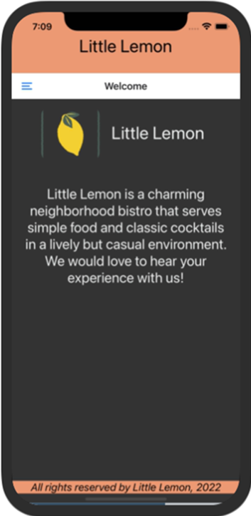
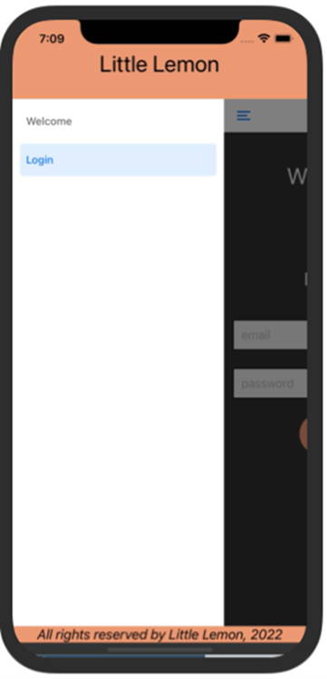
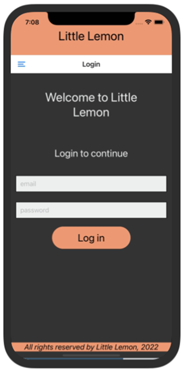

# Exercise: Configure Drawer Navigation

## Scenario
Below is what you will see on the emulator after you complete this exercise. You will notice a hamburger menu on the top left corner of the screen. The user can use the drawer and open it from left to right. Inside this drawer, options for the various screens, such as Login and Welcome, will be displayed. The user can click on any of the screens and navigate to that specific screen.

Below you'll find screenshots of the Login screen and the Welcome screen for your reference.




<br>
All of the code changes will be done in the App.js file. You do not need to make any changes to the other files and can use them as is.

## Instructions
### Step 1: Install Drawer navigation
First, you will need to install the Drawer Navigation library.

To do this, run the followng command:
```
npm install @react-navigation/drawer

```

You also need to install two more packages within your expo project, which are  react-native-gesture-handler  and  react-native-reanimated. You can install these by running the following line:
```
npx expo install react-native-gesture-handler react-native-reanimated
```
### Step 2: Instantiate createDrawerNavigator
The next step is to import the createDrawerNavigator from the package you just installed. Then you will instantiate the  createDrawerNavigator. This will be done in the App.js file. 

### Step 3: Setup Drawer Navigator and Drawer Screens with routes
Finally, you will remove the code that has already been written for tab navigation and replace it with the drawer navigator instead. Make sure to setup screens within the drawer and provide a default route as well. The two screens for drawer navigation in this example will be the Login screen and Welcome screen.

## Conclusion
By completing this exercise, you have practiced how to move between screens using the drawer navigator within your mobile app.