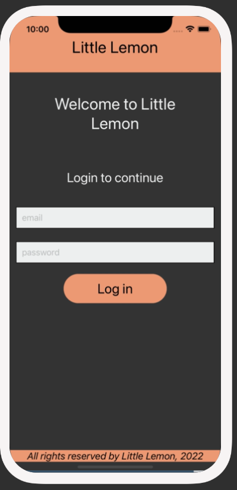
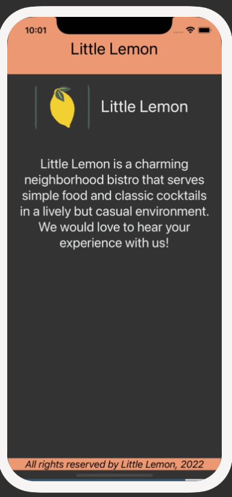

# Exercise: Set up Routes

## Scenario
Recall that we have created two screens within our Little Lemon app in previous exercises. You have the Welcome screen and a Login screen. At this stage, there is no way to navigate between these pages. In this exercise, you have been asked to set up React Navigation and basic routes using a Stack Navigator. Here you will include routes for both the Login and Welcome screens within the stack and provide a default route.

Please note that you will not be able to move between the screens at the end of this exercise. This will be covered in the next one. The aim of this exercise is to do the initial setup work to get started with navigation.

Below you'll find screenshots of the Login screen and the Welcome screen for your reference.

 
Once you complete this exercise you will see the following screen. Note that you cannot move between the screens yet.

## Procedure
### Step 1: Install React Navigation and other dependencies
Your first step is to install React Navigation within your Expo project and the dependencies. You will be using the native stack navigator so ensure to install that as well. Refer to the instructions linked below for detailed installation steps.

React Navigation:
<a href="https://reactnavigation.org/docs/getting-started/#installation" target="_blank">Getting started | React Navigation</a>

Native stack navigation:
<a  href="https://reactnavigation.org/docs/hello-react-navigation/" target="_blank">Hello React Navigation | React Navigation</a>

### Step 2: Instantiate native stack navigator
In this step, once the dependencies are all installed, you will add the necessary imports and instantiate the native stack navigator. You should also use the initialRouteName prop of the navigator to establish which screen the user starts on.

### Step 3: Setup routes within the stack
In this step, you will set up routes within the stack. The two routes you will have are the Login screen and the Welcome screen.

## Conclusion
By completing this exercise, you will demonstrate your understanding and ability to configure and set up a stack navigator with basic routes using React Navigation within your mobile app.