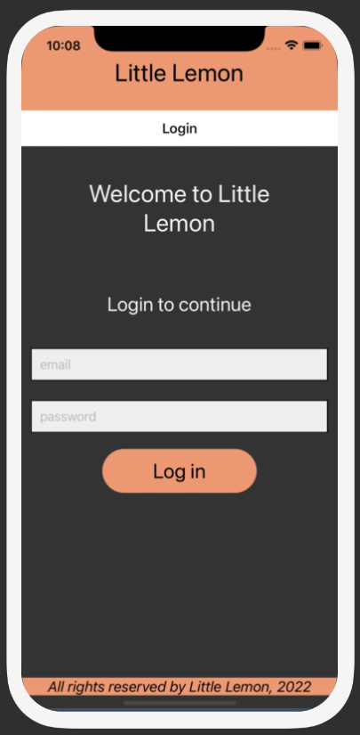
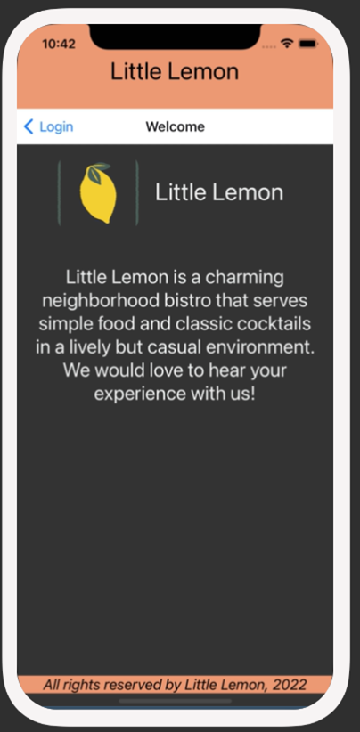

# Exercise: Exercise: Configure Tab Navigation

## Scenario
In this exercise, you will re-purpose the code you used to create stack navigation, to instead set up tab navigation within the Little Lemon app.




All of the code changes will be done in the App.js file. You do not need to make any changes to the other files and can use them as is.

## Instructions
### Step 1: Install tab navigation
Before you start, you will first need to install the Tab Navigation library.

To do this, run the following command:
```
npm install @react-navigation/bottom-tabs
```
### Step 2: Instantiate createBottomTabNavigator
Next, you will import the createBottomTabNavigator from the package you just installed. Then you will instantiate the createBottomTabNavigator. This will be done in the App.js file. 

### Step 3: Setup Tab Navigator and Tab Screens with routes
In this step, you will remove the code that has already been written for stack navigation and instead replace it with the tab navigator instead. Ensure to set up screens within the tab and provide a default route as well. The two screens for tab navigation in this example will be the Login screen and Welcome screen.

### Step 4: Configure icons for each Tab
In this final step, you will add icons to be displayed in each tab. This will be added to the screenOptions within the tab navigator and a tabBarIcon is set. You can use any icon of your choice to represent the Welcome screen and Login screen. 

You can import Ionicons from expo as shown below:
```js
import Ionicons from '@expo/vector-icons/Ionicons';

```

## Conclusion
By completing this exercise, you will be able to move between screens using the tab navigator within your mobile app.